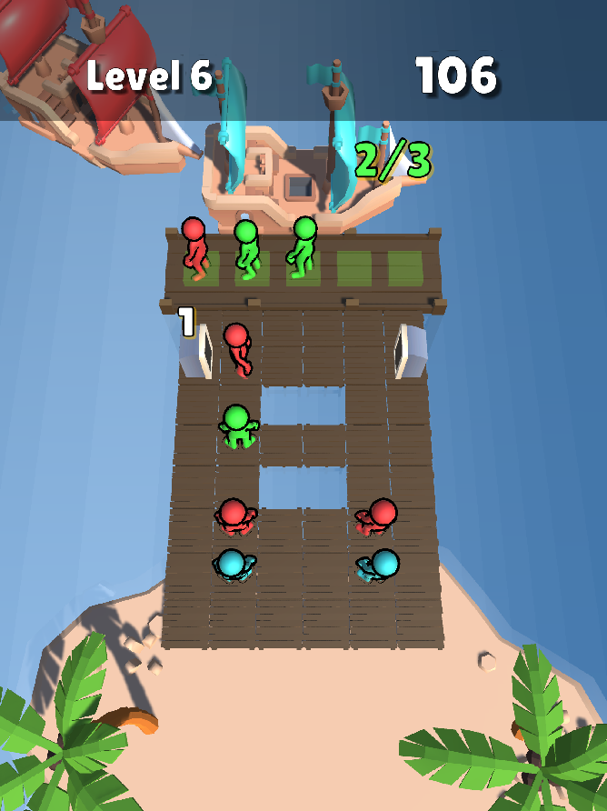

# Pirate Jam
A puzzle game where players organize passengers into matching colored ships.

## Core Gameplay
- Move passengers to their matching colored ships
- Each ship must be filled with exactly 3 passengers of the same color
- Use the bench area as temporary storage for passengers
- Clear paths strategically to access blocked passengers

## Game Mechanics
- **Hidden Passengers**: Some passengers are hidden and only revealed when paths to them are cleared
- **Tunnels**: Special tiles that release additional passengers in sequence
- **Bench System**: Limited slots for temporary passenger storage
- **Path Finding**: Passengers can only move if they have a clear path to the first row
- **Multiple Colors**: Match different colored passengers to their corresponding ships

## Features
- Progressive level system
- Level editor for creating custom puzzles
- Sound system with pooled audio sources
- Save system using PlayerPrefs
- Configurable:
 - Grid size
 - Time limits
 - Bench slot count
 - Ship sequences
 - Passenger placement
 - Invalid cell placement
 - Tunnel placement and orientation

## Technical Details
- Built in Unity
- Uses UI Toolkit for interface
- Scene-based level loading
- Singleton pattern for managers
- Custom grid system with modular cells
- JSON-based level serialization

## Level Design
- Tutorial levels introducing mechanics gradually
- Challenge levels combining multiple mechanics
- Each level requires strategic planning and resource management